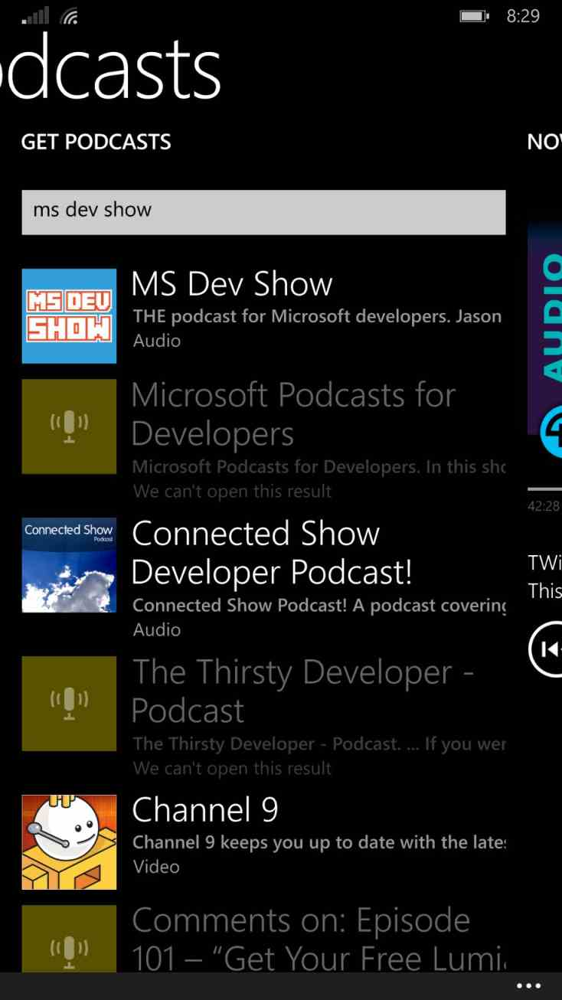
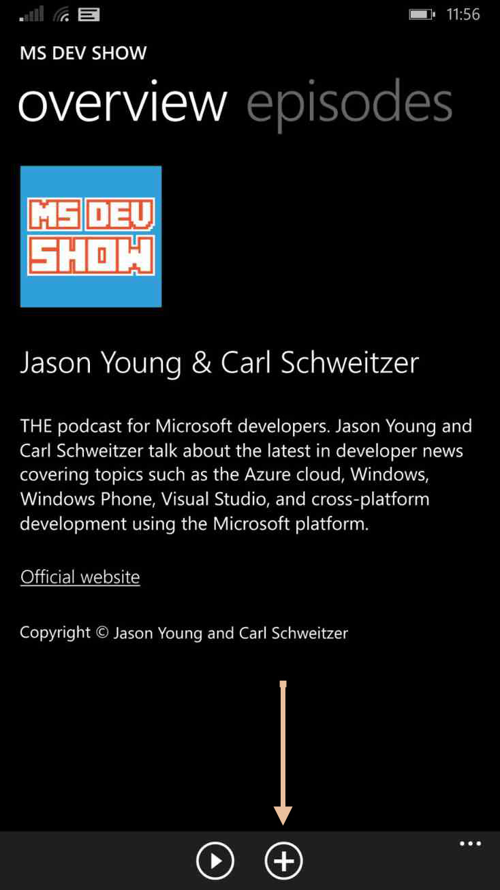

In Windows Phone 8.1, there is now a dedicated podcasting application. This is where you subscribe, listen, and manage all of your podcasts.

Launch the podcast app and simply search for **MS Dev Show**. Tap on our podcast.

Tap the **(+)** icon to subscribe.

