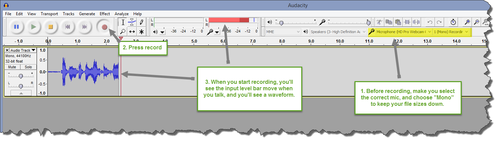
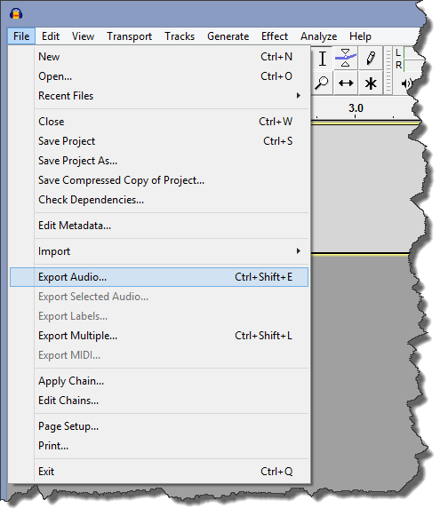
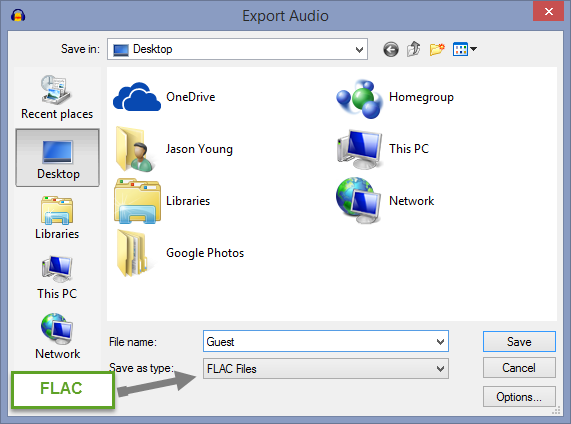
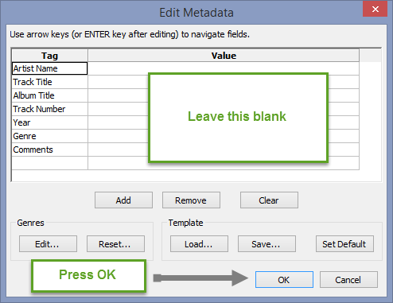

Recording your own audio track will **significantly** increase the audio quality of your episode. It takes only seconds to set up with a free tool called Audacity.

1. [Download Audacity from here](http://audacity.sourceforge.net/download/). Don't worry, it's free and a small download.
2. In Audacity, select your microphone, switch to mono, and hit record.

3. When done, hit the *Stop* button.
4. File->Export Audio...

5. Be sure to select **FLAC** as the file type. Name the file anything you like.

6. No metadata is needed, just hit OK.

7. Upload the file to Dropbox, OneDrive, or your file sharing service of choice.
8. Send the link to [feedback@msdevshow.com](mailto:feedback@msdevshow.com)

### FAQ

* **What if I'm unsure which microphone is correct?** Do a test recording before the show, and tap on the mic you're using. Listen to the recording. Be sure to discard that track before recording for the show